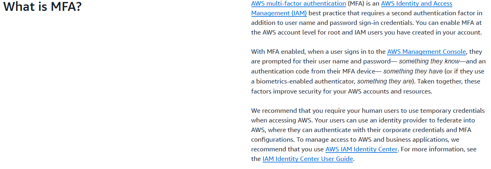

# Ben Pennycook's learning log - AWS hosting

## Entry 1 - Starting out.

### My prior experience with cloud computing 

Long before beginning this project (2023) I began the IBM Full Stack Software Developer Professional Certificate. Despite never finishing it due to A-Levels and the like, one major section of the course I completed was the cloud computing one. 
  
> [The IBM Full Stack Software Developer Professional Certificate](https://www.coursera.org/professional-certificates/ibm-full-stack-cloud-developer)
  
Unsurprisingly I don't remember much from the course, which makes tackling the AWS side of this project even more exciting for me. This is an opportunity to get back into cloud computing and gain some career-relevant experience. What I do remember from the course, is that  

### What is AWS anyway?

AWS (Amazon Web Services) is the world's biggest cloud computing platform. With datacentres globally, it is used by huge companies such as:

- Sony, who spend $11M monthly
- Adobe, who spend $7.5M monthly
- Facebook, who spend $5.6M monthly

By being the first in the cloud computing market Amazon were able to set industry standards and never struggled to pick up big customers like the aforementioned Sony, who signed up in 2012 in order to handle a growing player base on their PlayStation consoles. This, combined with AWS having little to no competition for years after its birth, led Amazon to easily dominate the cloud infrastructure world.

Amazon provides many different services with AWS, the most popular (according to Reddit) being:

- EC2, which provides virtual servers

- S3, which provides simple data storage

- Lambda, which provides serverless computing

### Which service will we use?

When researching these different services, and deciding what to finally use in this project, there were two major boxes I needed to tick. The service had to be completely free, and capable of deploying a React app. 

No AWS service is free, but luckily Amazon offers a 'Free Tier' which provides you with up to $200 in AWS Credits. Despite this, I have heard horror stories of people going over this $200 limit and racking up tens of thousands in debt due to usage costs. To prevent this, I researched ways to set buffers and alerts that activate once a certain number of free credits have been used. 

Regarding the second necessity, deploying a React app, I found many services capable of this. The most popular option was a combination of S3 and CloudFront, which store data and deliver data (respectively). However, since our project doesn't necessarily require a backend, I found Amazon's 'Amplify' to be a better option. This is because it can deploy a web app straight from a GitHub Repository, which was perfect for our small project that will be stored here on GitHub.

So the decision was made, I would be using Amazon's Amplify service to deploy our project's app.  

## Entry 2 - Be open to change.

### Big changes

After a group video call between Mark, Elliot, and I, we compared ideas and it gave us all direction. For the other guys, we had set out a general plan for the frontend and backend of our application. For me, I was able to plan how I'd deploy the app. Notably, how I would deploy the app now we had decided to add a backend. 

Because of this change, I would no longer be able just simply deploy it with Amazon Amplify, and so I was sent back to the drawing board. The great part about collaboration is that we are challenged by our peers to create something even better than what we had originally planned. It was at this point where I gained an insight on how the other boys were doing, and I noticed that the UI looked incredible. We wanted a modern, minimalist look, and this was definitely achieved. 

My other team members and I have made a group chat, which we communicate on almost daily. This has been very important for small communications in between our video calls. 
  
### Which service will we use? Part 2

After some research, I have come to the conclusion that, while still using Amplify to deploy the frontend, I would use Lambda. According to Wikipedia:

> AWS Lambda is an event-driven, serverless Function as a Service provided by Amazon as a part of Amazon Web Services. It is designed to enable developers to run code without provisioning or managing servers. It executes code in response to events and automatically manages the computing resources required by that code.

What this means for our project, is that the React application will call the backend API which will be hosted on Amazon's Lambda serverless service. This is much more effective than the more popular EC2 service, as it requires less maintxenance  than EC2, and has less risk of costing me money. 

## Entry 3 - Delays!

### A huge setback

For two weeks, I was unable to access AWS services. This started when I tried to access them from a VPN and was met with a sign-in error, but this was just the start of my problems! I was then required by AWS to change my password, but the verification email would never get sent to me. After many attemps I grew frustrated and put the issue aside for awhile. 

In a rash decision I tried to start over and make a new account, however because my bank details were attached to the 'locked' account I was not able to create a new one (none of my family trusted me handling an AWS account with their bank detais). So, with no options left and as the project deadline got closer I decided to look further into the issue and realised the verification emails were going elsewhere! As part of MFA (multi-factor authentication) I had multiple emails attached to the AWS account and all of the missed emails were being sent to an account I no longer properly use, apart from for MFA purposes. 

Embarrassed and a week behind, I knew I had to make progress quick! Before I could steam ahead however, I looked into Amazon Web Services' MFA guidelines:

&nbsp;

&nbsp;

Having learned this important information I was able to finally deploy our app. 

