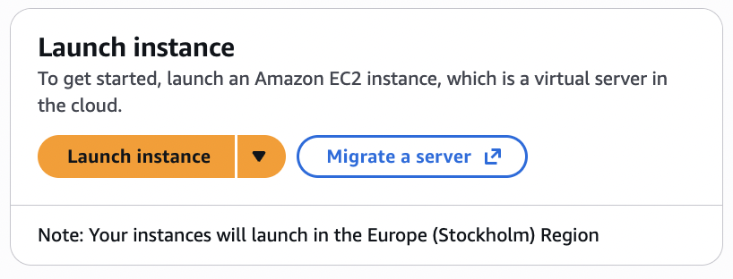
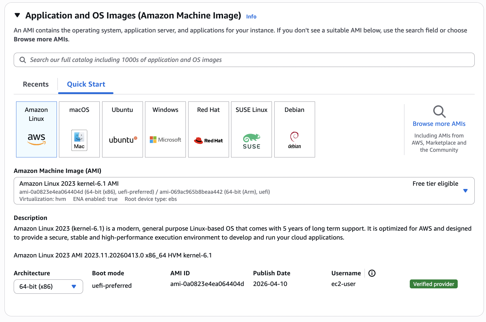
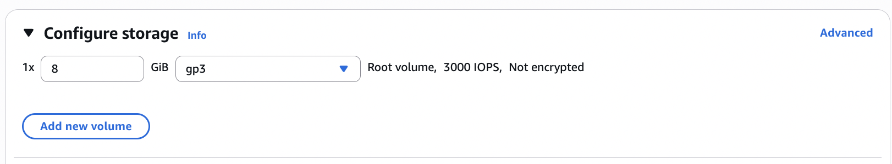
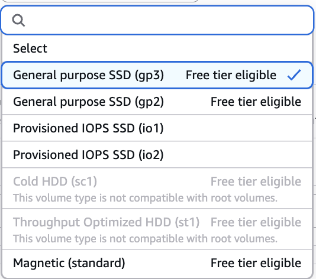

# Guide for learners - AWS hosting

## Motivation - Why learn it?

### Scaling

AWS hosting has approximately 31% market share according to [Statista](https://www.statista.com/), and is used by huge companies worldwide. 
But how is it useful to us for a small-scale project like this? Well what makes AWS so powerful to both corporations and tiny projects alike is its ability to scale. 
Most services provided by Amazon are designed to scale to the needs of the user, and some even auto-scale. This allows the exact same services to be used by 1,000,000
people concurrently, or none at all. 

Obviously the cost of each service will scale along with the size of the project, but for small projects like this one, the [AWS Free Tier](https://aws.amazon.com/free/)
will suffice. Providing $100 in credits, with the ability to increase that to $200, which can be used for any AWS services. Some of the more basic services are also provided 
completely free on this tier. 

### Costs

As mentioned above, the average developer can use AWS without ever paying anything. However for those with projects that use a lot of compute, such as any AI projects
costs can incur. AWS is perfectly catered to this due to its budgeting system. It allows the user to set budgets that when passed, will alert you via email. There is no sort of 
'failsafe' to stop AWS services from incurring costs past a certain budget, likely for profit-making reasons, however it is recommended to set budgets lower than you are willing 
to spend so that you are alerted before you receive a large bill. 

Personally, while using the free tier I set up a zero spend budget. According to AWS themselves:

> [Zero spend budget](https://docs.aws.amazon.com/cost-management/latest/userguide/budget-templates.html):
> A budget that notifies you after your spending exceeds AWS Free Tier limits.

This was absolutely necessary as I was not prepared to spend any money on this coursework. Luckily, I have not gone over my free tier allowances yet.  

### Ease of use

Having been around for over 20 years now, AWS has mastered its user-friendly approach to the point where minimal outside research is required. Small guides like these should be 
enough for the average developer to deploy their first app. 

Also because Amazon has provided these services for so long, there are countless useful guides on the internet. My favourite ones will be provided in the learning materials section.

## Background - What do you need to know before starting? 

This guide is aimed primarily towards a developer who has never used AWS before, and ideally having never hosted a server or deployed an application via any cloud computing platforms.

While not exactly necessary, I would definitely recommend anyone that is looking into AWS hosting to learn the basics of cloud hosting. There are plenty of free online 
courses which I shall provide in the learning materials section, but any will do. This just gives you an insight into what is going on behind the incredibly user-friendly
scenes of AWS.

I completed the 'Cloud Computing' section of [IBM's Fullstack Developer Course](https://www.coursera.org/professional-certificates/ibm-full-stack-cloud-developer), 
and I can confidently say that it has helped in the hosting process and helped by making me feel like I've not been thrown in the deep end. Despite this, I would not
recommend that specific course to someone trying to learn AWS as it costs a pretty penny and is more of a general cloud computing learning experience. 

AWS officially has over 900 data centres across the globe, and therefore your closest datacentre will vary. For me, I was automatically assigned to one in Stockholm, Sweden. Although interestingly, there is one in London (much closer).

More generally, you'll need to know exactly what service to use. This is the only part of AWS that isn't perfectly user-friendly. First, you need to figure out what you need from
a service, and if you're not on the free tier then mentally set aside an amount of money that you're happy to use. Then, use the many guides across the internet to find the service 
that works best for you. From there, select the service on the AWS console and follow the provided steps. Depending on the service either connect your GitHub repository or provide 
a zip file containing the files you wish to host, then apply your desired build settings and deploy! See below for a more detailed and general guide.

## A general guide

### Signing up

The first step to AWS hosting is to make an account. This is pretty similar to most signups however due to the nature of AWS the security is a priority. Because of this, you will 
be asked to set up MFA (multi-factor authentication) by providing a secondary email and using an authenticator app on your phone. After setting this up, you will be asked for your
card details. This is what puts most people off, but if you follow the budget tips mentioned earlier you won't be charged any money. Once you have provided these detials, you are 
now signed up to the AWS console, and from here you are now able to use all of the AWS services. 

### Choosing a service

The AWS console will not tell you what service you need to use based on your use case, it is up to you to find one. Luckily, AWS does provide a guide that contains most of its popular 
services and their purposes.

> [Choosing guide:](https://docs.aws.amazon.com/compute-on-aws-how-to-choose/) This is where I found the correct services to use for my project.

Once you have chosen, find the search bar in the console and open up the service. The most popular is EC2, 'Secure and resizable compute capacity for virtually any workload' 
according to AWS. As it is the most common service to use I shall provide a quick guide through setting it up. 

Once on the service's page, you'll be greeted with this:

&nbsp;

If it is your first time doing this, press 'Launch instance'. If you have a server hosted somewhere else and would like to transfer it to AWS, press 'Migrate a server'.

You are then greeted with some options on how to host your server. Most people will simply select 'Amazon Linux', but in more niche cases where only Apple devices are used to access
the server 'macOS' could be used for more efficient file sharing.

&nbsp;

After you have chosen a server type, you can choose how much storage you would like. Although EC2 automatically scales to your needs, you can manually scale the server at this stage.

&nbsp;

Aside from the amount of storage, you can also select a storage type. As you can see below, not all of these are available on the free plan. Why you would want to use magnetic storage 
over SSD I have no idea. It's probably cheaper. At this stage, we will start to notice examples of how the free tier holds us back. However, for any small project the free tier options
will most likely be just fine. 

&nbsp;

After this, press 'Launch instance' and you have just hosted your first server through AWS. 

Many services have a very similar process to this. I have used Amazon's 'Amplify' and 'Elastic Beanstalk'. Funny names. They both had an almost identical launching process, however Amplify launched with files from a GitHub repository, and Elastic Beanstalk launched with files from a provided zip folder. 

## Learning materials 

#### A free course from the reputable W3Schools that guides you through a lot of the AWS basics and tests you along the way: 

> [https://www.w3schools.com/aws/](https://www.w3schools.com/aws/)

#### The free tier of AWS, which anyone can sign up to:

> [https://aws.amazon.com/free/](https://aws.amazon.com/free/)

#### The guide on how to choose what service to use: 

> [https://docs.aws.amazon.com/compute-on-aws-how-to-choose/](https://docs.aws.amazon.com/compute-on-aws-how-to-choose/)

## Evaluation - How useful is the skill?

I would say that understanding cloud hosting is essential for anyone trying to host their application for the world to use instead of just locally, AWS specifically however because it is the most popular cloud computing platform. This means that a great proportion of companies will use Amazon's services and so be keen for their employeed to know the AWS basics. A skill like cloud hosting will generously boost your CV. 

As job opportunities decrease in the computer science market, we need to try and differentiate ourselves in any way possible. Being able to host servers and deploy applications through AWS is just one of many ways to do this. 

It is also a relatively easy skill to learn compared to many other computer science skills, for example, learning how to use AWS is much more simple than learning a whole programming language. AWS specifically is the best platform for beginners due to its abundance of guides and tutorials for those new to the craft. The free tier accentuates this, as having free access to so many services along with limited free access to all services makes AWS an unmatched platform for beginners. 

